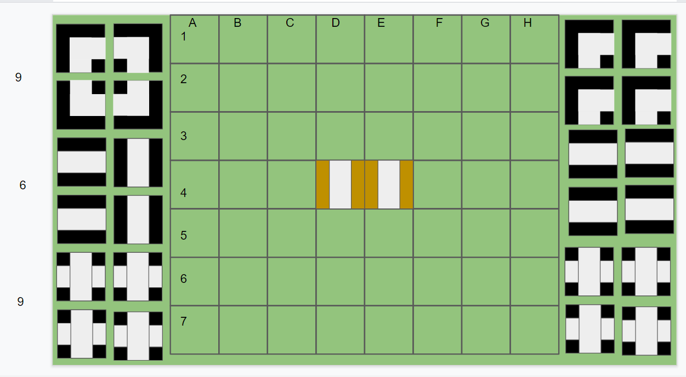
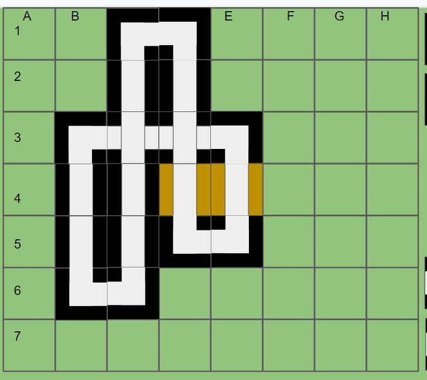
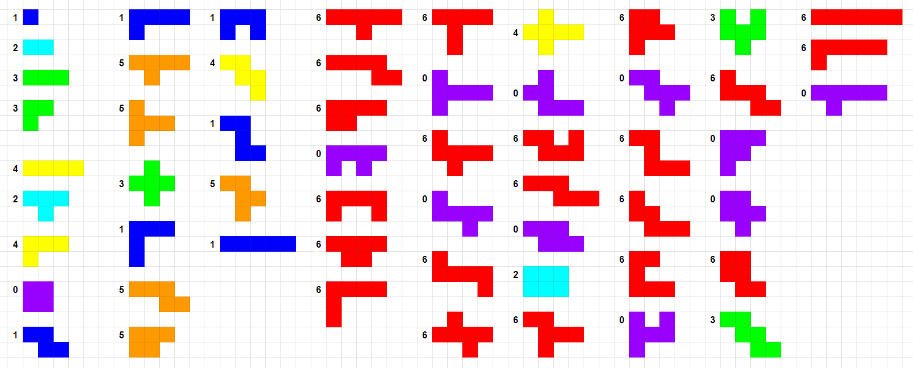
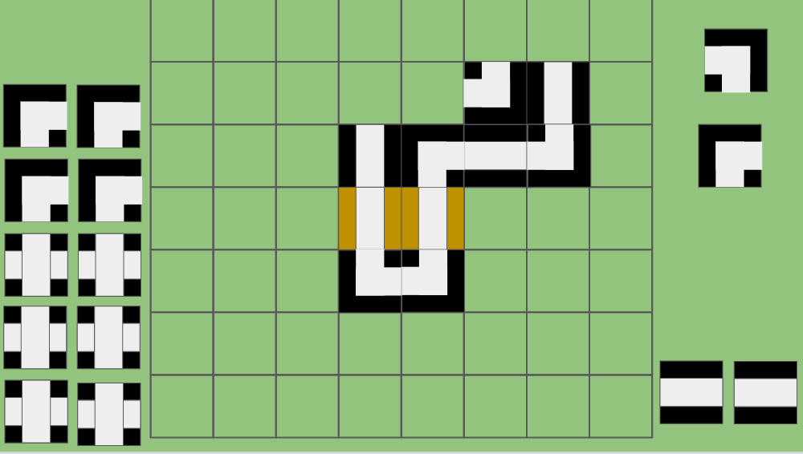

# MonUnrail
MonUnrail was a game created by ISamEI for the Online Reality Game (ORG) Genius Invitational as a duel to determine which of two players was to be eliminated from the game. I ended up in it, and ended up teaching myself game theory, nimbers in particular, and solved the game - and ended up winning it.

## Original rules
(lightly edited)

MonUnrail is a simple game similar to The Genius's
[Monorail](https://the-genius-show.fandom.com/wiki/Monorail)
with one small twist - once the track is constructed, both players must start deconstructing it. 

There are two parts to the game: 

### Building the Track
Players must build a complete circuit that fully utilizes all the pieces placed on the board, connecting them to the starting pieces (both bars of the crossroads be used in the track if a crossroads tile is placed). Players can place 1, 2, or 3 tiles on their turn, and those tiles must all be in a row adjacent to one another. At least one tile you place must be adjacent to an existing tile. 

If you believe it is impossible to complete a track with the remaining pieces, you may call Impossible. If your opponent cannot complete the track with unused tiles, you win the game. Otherwise, your opponent wins the game.

Three types of tiles will be available: straight lines, turns, and crossroads. Their exact quantity will be unknown, but there will be at least 16 tiles total. 

If you complete the track, then your turn immediately ends and the unrailing phase begins.

### Unrailing

After the track is complete, players can remove tiles from the track 1, 2, or 3 at a time. If you remove more than 1 tile, those tiles must all be touching each other in a row or column. 

The two starting tiles can also be removed.  When unrailing, you can no longer call impossible.

### Pie Rule
The game will additionally be played with pie rule. After the first player moves, the second player can choose whether or not they would like to take the first player's position and have the first player make the next move.

### Winning
Whoever removes the last tile, fully un-railing the board, wins the game.

### Examples
  
A typical setup

  
A finished track, to commence the unrailing.

## Solving unrailing
I initially focused on solving the second phase of the game, since that's the crucial part that decides the game. I later went on to solving phase one - but let's stick with the unrail for now.

Let's start with some simple examples to get started. In the unrailing phase you can completely ignore what type of rail the tiles are - since the only requirement is that you remove tiles that are touching each other in a row or column. We can therefore simplify the board and just represent it as singular tiles.

The player that removes the last tile wins, so any of the following boards are a win for the current player:
```
🟩🟩🟩
🟩⬜🟩
🟩🟩🟩
```
```
🟩🟩🟩🟩
🟩⬜⬜🟩
🟩🟩🟩🟩
```
```
🟩🟩🟩
🟩⬜🟩
🟩⬜🟩
🟩⬜🟩
🟩🟩🟩
```

Since they can easily remove all of the tiles in a single move.

But the following boards are a win for the *other* player:
```
🟩🟩🟩🟩🟩
🟩⬜🟩⬜🟩
🟩🟩🟩🟩🟩
```
Since the tiles need to be connected to remove, you can only remove one of these tiles - in which the other player easily responds by taking the last one.

```
🟩🟩🟩🟩
🟩⬜⬜🟩
🟩🟩🟩🟩
🟩⬜⬜🟩
🟩🟩🟩🟩
```
Here you're faced with two options. Take both tiles from one pair, in which the other player responds by finishing the other. Or you take one tile, leaving it as:
```
🟩🟩🟩🟩
🟩⬜🟩🟩
🟩🟩🟩🟩
🟩⬜⬜🟩
🟩🟩🟩🟩
```
where the other player mirrors your move and leaves you with the same state as the previous example.

In fact all cases where there are two unconnected identical shapes are a win for the other player, since they can always mirror your move.

```
🟩🟩🟩🟩🟩
🟩⬜🟩⬜🟩
🟩🟩🟩🟩🟩
🟩⬜🟩⬜🟩
🟩🟩🟩🟩🟩
```
Here neither player has any choice, and they will take the final tile.


Let's now get into a couple more funky shapes, if you're faced with these shapes - can you win? (Given that opponent plays optimally)
```
🟩🟩🟩🟩🟩
🟩⬜⬜🟩🟩
🟩🟩⬜⬜🟩
🟩🟩🟩🟩🟩
```
```
🟩🟩🟩🟩
🟩⬜⬜🟩
🟩⬜⬜🟩
🟩🟩🟩🟩
```
```
🟩🟩🟩🟩🟩🟩
🟩⬜⬜⬜⬜🟩
🟩🟩⬜🟩🟩🟩
🟩🟩🟩🟩🟩🟩
```
```
🟩🟩🟩🟩🟩🟩
🟩⬜⬜⬜⬜🟩
🟩⬜🟩⬜🟩🟩
🟩🟩🟩🟩🟩🟩
```
<details><summary><b>click to reveal answers</b></summary>
<p>yes, no, yes, no</p>
</details>

## Nimbers
Now we're hitting the limits of what you can brute force figure out on your own, and it's time to introduce the theory. I was introduced to [Nimbers](https://en.wikipedia.org/wiki/Nimber) and it took me a couple days to understand the wikipedia pages, learn how it worked and finally apply it to Unrail, but in the end it's actually quite simple.

Any time it's your turn to move, you can either force your opponent into an unwinnable position - or you're in an unwinnable position. It's relatively straightforward to calculate if you're in an unwinnable position (given small/few shapes). For every shape we can calculate a nimber. The empty board is given nimber 0, and every subsequent shape is assigned **the lowest nimber that cannot be achieved by making a legal move**. If the value of the board in front of you is 0, you're in an unwinnable position. (If the board is empty, the opponent just took the last piece and won)

So, a couple examples:
##### Example 1
```
🟩🟩🟩
🟩⬜🟩
🟩🟩🟩
```
We can construct the empty board by removing the tile, which is nimber 0. That is the only move that can be made - so this shape is given the nimber 1.
##### Example 2
```
🟩🟩🟩🟩
🟩⬜⬜🟩
🟩🟩🟩🟩
```
We can remove 1 tile, getting the above shape (1) or remove two, getting the empty board (0). It's therefore 2.  

##### Example 3
```
🟩🟩🟩🟩
🟩⬜⬜🟩
🟩⬜🟩🟩
🟩🟩🟩🟩
```
If we remove one of the end pieces, we get the above tile (2). If we remove two pieces we get a single tile (1). But what happens if you remove the middle piece and get two 1x1's? From earlier we knew that's a losing position for the current player, which is your opponent, and unwinnable positions are given the nimber 0. So this must be a 3.

The formula for multiple separate shapes, or nimbers, is given on wikipedia as [nim-addition](https://en.wikipedia.org/wiki/Nimber#Addition) - but it's in fact equivalent to binary [XOR](https://en.wikipedia.org/wiki/Exclusive_or) which most programmers will be familiar with. If you're not, I'll give a quick example calculation:
<details><summary><b>What is 5 XOR 3 XOR 8</b></summary>
We first start by converting every number into it's binary equivalent:

```
5 =       1*4 + 0*2 + 1*1 =  101
3 =             1*2 + 1*1 =   11
8 = 1*8 + 0*4 + 0*2 + 0*1 = 1000
```

XOR means "Exclusive OR", and is defined as true (i.e. 1) if one of it's input is true, but not the other. So `1 XOR 0 = 1`, but `1 XOR 1 = 0` and `0 XOR 0 = 0`

We now take the terms pairwise and do an XOR on each binary digit
```
5 XOR 3 = 101 XOR 11 = [1 XOR 0][0 XOR 1][1 XOR 1] = [1][1][0] = 110 = 6
6 XOR 8 = 110 XOR 1000 = [0 XOR 1][1 XOR 0][1 XOR 0][0 XOR 0] = 1110 = 14
```

This might seem tedious, but if you're experienced working with binary numbers you can relatively quickly do these calculations. And for this case you only care if the result is 0 or not, and typically work with very small numbers, which makes it easier.
</details>

So we can go back to the previous shape, where if we remove the middle piece of the L-shape we get two 1x1's, which both have the nimber 1 - so we calculate the nimber by doing `1 XOR 1 = 0`, as expected!

If it's your turn, and the nimber of the shapes in front of you *isn't* 0 - well than that means that you can make it 0! Even if you're doing nim-addition, my original statement that the nimber of a shape is the lowest value you cannot move it into, is true even for multiple shapes - so a non-0 value means you make move into a 0. There's unfortunately no simple way of finding a move (or *the* move if you're unlucky) to make it zero though (as far as I know...), you simple have to go through all the possible moves - calculate the nimber of the resulting shape, and if it's not 0 - keep going. If you don't find any moves ... then you might just be at a 0 yourself and have lost!

This is in fact all that's needed, and once I'd realized this and verified it, I sat down with a pen and paper and started calculating nimbers. This is what I, and my co-contestant e that helped me, came up with:

(Although there were a few errors in the original, which I've since fixed).
There's some intriguing patterns in the shapes

We can look at a larger example from the death match, where it was my turn to move:

This is quite a large shape, and when playing I did not know what nimber it was (it's 2). There's 5 different moves (three that split it, and two that give a shape that cannot be broken down into 0) that makes it a nimber 0. Given the above cheat-sheet can you find one? All of them?
<details><summary><b>Optimal moves</b></summary>
Using coordinates where the upper left square is A1: D3+E3, F3+G3, F2+F3, F2+G2, G2+G3. Several spectators spotted the first one, while I did the second one. I found the last two with my solver.
</details>

Theoretically it's possible to solve any size of shape, and I wrote a solver that can crunch shapes with more than 20 tiles before it starts taking quite a long time.

## Railing phase nimbers
Since we can (in theory) solve the entire unrailing phase now, that means that you can start using this info towards the end of the railing phase - where if you know that finishing the given shape makes it a 0, you should do it. But the nimbers in the railing phase will depend on the specific tiles available and how they can be connected, and in practice it's not until you're at the end of the railing phase when the options are much more limited that it starts to become possible to calculate railing nimbers. The algorithm for doing so is much the same though.


## Interesting (non-)patterns
1xN nimbers from 1 to 100 in rows of 34 (???)
```
1  2 3 4 5  6  7  8 9 10 11 12 13 14 15 16 17 18 19 20 21 22 23 24 25 26 27 28 29 30 31 32 33 34
------------------------------------------------------------------------------------------------
1  2 3 4 1  6  3  2 1  6  7  4  5  8  1 10  5  4  7  6  1  2  3  6  1  4  3  2  1  8 10  4 14 16
1  2 3 4 1  6  3  2 1  6  7  4  5  8  1 10  5  8  7  6  1  2  3  6  1  4  3 14  1  8 10 16 14 18
1 10 3 4 1  6  3  2 1 20  7 16  5  8  1 10  5  8  7 14  1  2  3  6  1 12  3 14  1  8 10 16 14 18
1 10 3 8 1  6  3  2 1 20  7 16  5  8  1 10  5  8  7 14  1  4  3 20  1 12  3 14  1  8 10 16 14 18
1 10 3 8 1 13  3  2 1 20  7 16  5  8  1 10  5  8  7 16  1  4  3 21  1 12  3 14  1  8 10 16 14 18
1 10 3 8 1 13 16 24 1 20  7 16  5  8  1 10  5  8  7 16  1  4  3 21  1 12  3 14  1  8 10 16 14 18
```
which seems to be semi-repeating every ... 34(??) nimbers. Also note the reverse symmetry between `1 2 3 4 1 6 3 2 1 6 7 4 5` and `5 4 7 6 1 2 3 6 1 4 3 2 1` - although that seems to break down in later rows. Column 24 also shows that a number may change more than once.


solid 2xN blocks
```
0 1 2 3 4 5 6 7 8 9 10 11 12 13 14
----------------------------------
0 2 0 2 0 2 0 6 0 2  0  2  0  2  0
```
Why the hell is 2x7=6??
(conjecture: 2x2N blocks are always 0?)  
There's likely something here about rotational symmetry, maybe something like "Nimber=0 if there's two-way rotational symmetry and [...]" since you can always mirror your opponent's moves rotated 180 degrees - but it needs an additional clause to rule out 2x(N-1) (at least)

solid 3xN blocks
```
0 1 2 3 4 5 6 7
---------------
0 3 2 1 2 3 6 4
```
solid 4xN blocks
```
0 1 2 3 4 5
-----------
0 4 0 2 0 7
```
solid 5xN blocks
```
0 1 2 3 4 5
-----------
0 1 2 3 7 1
```

```
    1 2 3 4 5 6 7 8 9
  _____________
1 | 1 2 3 4 1 6 3 2 1
2 | 2 0 2 0 2 0 6 0  
3 | 3 2 1 2 3 6 4
4 | 4 0 2 0 7
5 | 1 2 3 7 1
6 | 6 0 6
7 | 3 6 4
8 | 2 0
9 | 1
```

(reading the diagonals)
```
1
2
3 0
4 2
1 0 1
6 2 2
3 0 3 0
2 6 6 7
1 0 4 ? 1
```
(stronger conjecture: 2Nx2N blocks are always 0) ... maybe: A rotationally symmetric rail in a 2Nx2N bounding box is always 0?  
(2N-1)x(2N-1) blocks with the middle tile taken out are also 0 though, which the above doesn't cover.
